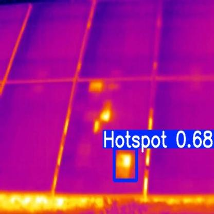
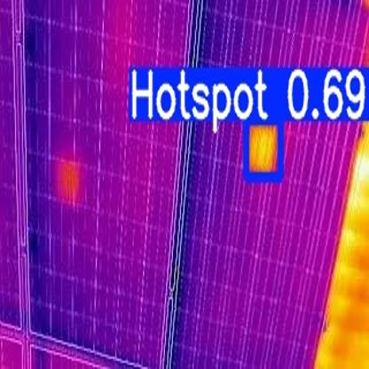
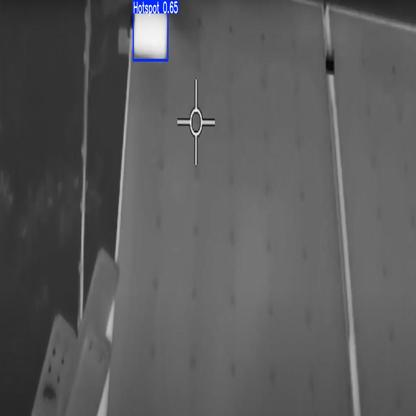
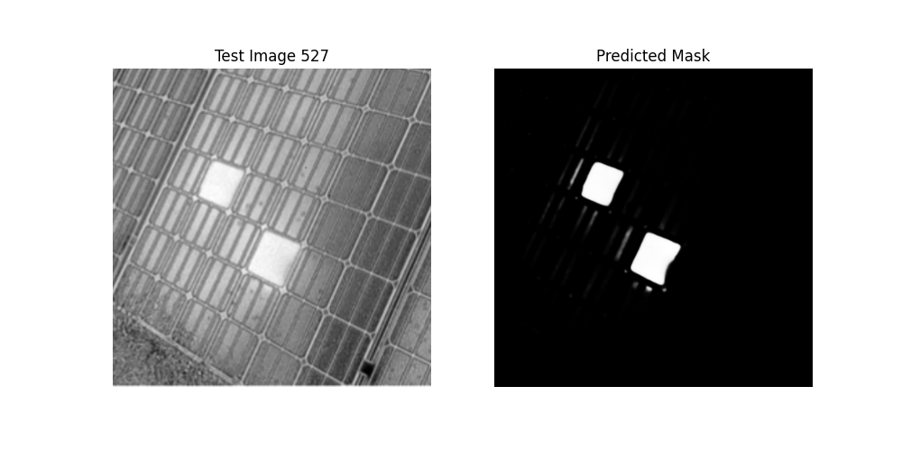
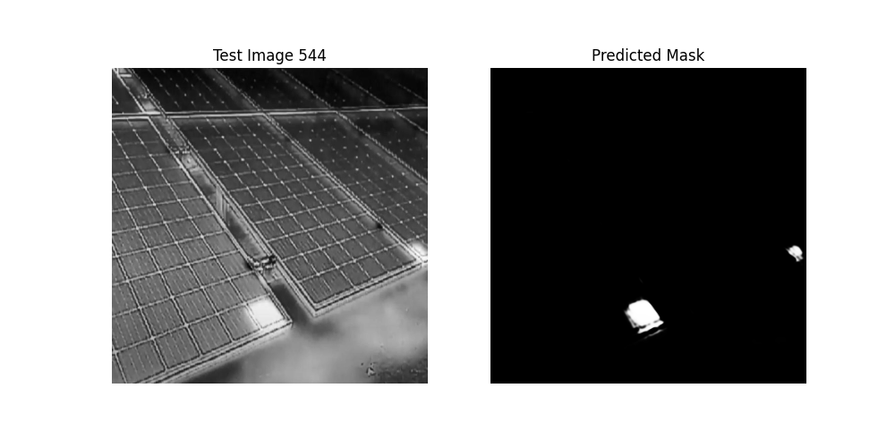
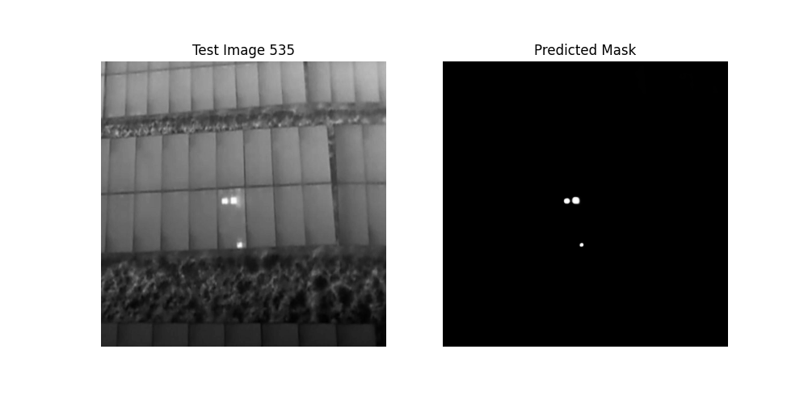

# AI-Based Hotspot Detection in Solar Panels

A computer vision project for detecting thermal hotspots in solar panels using infrared thermal imagery.

## Overview

This project investigates two deep learning approaches for automated solar-panel hotspot detection:

- **YOLOv5** for object detection
- **U-Net** for semantic segmentation

The objective was to compare the two approaches and understand their strengths and limitations for solar-panel inspection.

## Dataset

The training dataset consisted of **501 thermal images** of solar panels.

The images were:

- Converted to grayscale
- Resized to **416 × 416** pixels
- Manually annotated for hotspot regions

The annotations were converted into two formats:

- **YOLO-format bounding-box labels** for object detection
- **Binary segmentation masks** for U-Net

The project also used separate thermal images for testing to examine model behavior on previously unseen images.

## Models

### YOLOv5

Two YOLOv5 variants were investigated:

- **YOLOv5s (Small)**
- **YOLOv5m (Medium)**

The models were trained to detect hotspot regions using bounding boxes.

The YOLOv5m model generally performed better when multiple hotspots were close together, while YOLOv5s provided a lighter alternative.

### U-Net

A custom **U-Net** model was trained for semantic segmentation.

Instead of predicting bounding boxes, U-Net produces a pixel-level mask representing the detected hotspot regions. This provides more detailed information about the shape and spatial extent of the detected anomalies.

## Results

The project evaluated the models using quantitative metrics and visual inspection.

### YOLOv5

The YOLOv5 models successfully detected hotspot regions in thermal images, including images containing multiple hotspots.

The repository includes the trained YOLOv5 model and representative detection results.

### U-Net

The U-Net model was trained for pixel-level hotspot segmentation.

Representative segmentation outputs are included in the repository together with the trained model weights.

> **Note:** The U-Net evaluation pipeline is still being refined, so numerical segmentation metrics are not reported here unless they can be independently reproduced from the published implementation.

## Example Outputs

### YOLOv5 Detection







### U-Net Segmentation







## Current Status

- **Dataset preparation:** Completed
- **Model training:** Completed
- **YOLOv5 hotspot detection:** Available
- **U-Net hotspot segmentation:** Available
- **Deployment:** Not yet implemented

The models have **not yet been deployed**.

## Future Work

Planned improvements include:

- Expanding the dataset to improve model generalization
- Further refining the U-Net training and evaluation pipeline
- Investigating larger YOLOv5 architectures
- Deploying the selected model as an API
- Integrating the system with thermal cameras
- Exploring automated hotspot alerts for solar-panel inspection

## Project Structure

```text
solar-panel-hotspot-detection/
│
├── detection/
│   ├── best.pt
│   └── data.yaml
│
├── segmentation/
│   └── trained_unet2.pth
│
├── examples/
│   ├── yolo_result_1.jpg
│   ├── yolo_result_2.jpg
│   ├── yolo_result_3.jpg
│   ├── yolo_result_4.jpg
│   ├── yolo_result_5.jpg
│   ├── yolo_result_6.jpg
│   ├── yolo_result_7.jpg
│   ├── yolo_result_8.jpg
│   ├── unet_result_1.png
│   ├── unet_result_2.png
│   └── unet_result_3.png
│
├── results/
│   ├── confusion_matrix.png
│   ├── F1_curve.png
│   ├── PR_curve.png
│   └── results.png
│
├── docs/
│
├── README.md
├── .gitignore
└── .gitattributes